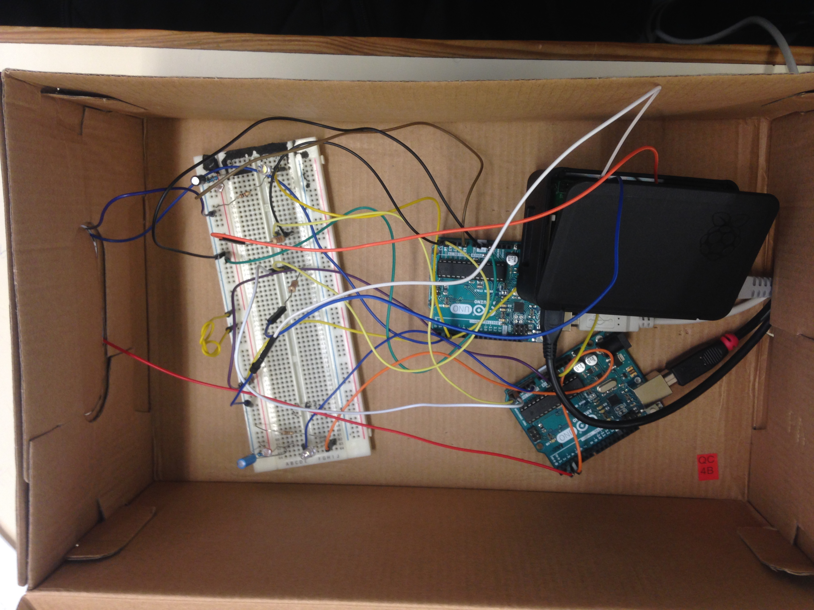

# Real-Time Cooperative Decentralized Control of a Smart Office Illumination System
Distributed Real Time Control Systems Project, @IST Lisbon, 2018-19

## Authors

+ João Gonçalves
+ Francisco Castro
+ Daniel Schiffart

## Project description
[Document.](Docs/SCDTR1819-Project-v1.2.pdf)

## Files

+ Arduino code in `Arduino_final`
+ cpp server code in `Server`
+ Report latex files in `Report`
+ Weekly stages in `Week1` - `Week9`

## Final report
[Final report.](Report/main.pdf)

## Ulicensed
